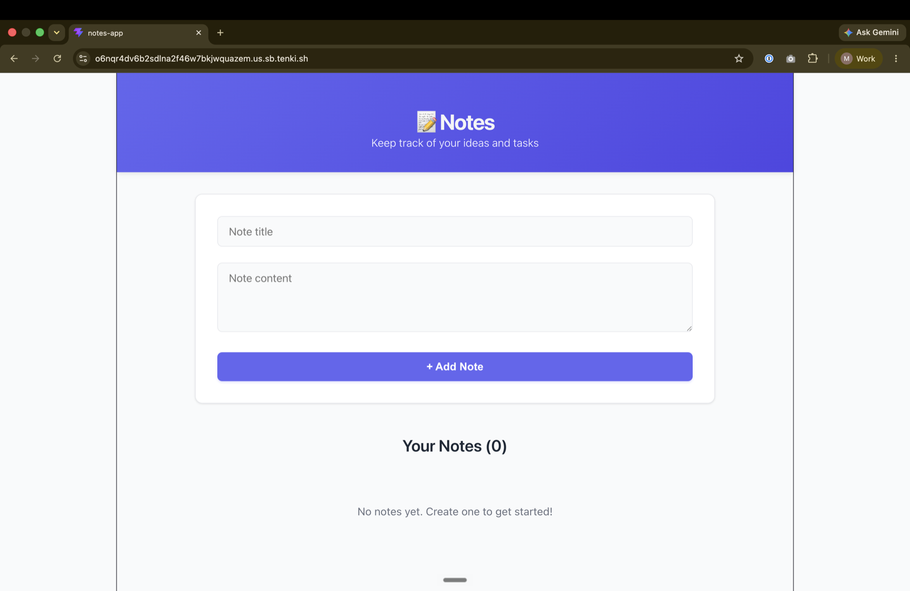

# Coding Agent Example (AgentKit + Tenki)

## Overview

This project demonstrates a fully autonomous coding agent capable of performing software development tasks in a [Tenki](https://tenki.cloud) sandbox environment. The agent is built using [AgentKit](https://agentkit.inngest.com/) and leverages Tenki sandboxes for secure, isolated execution. The agent can create simple web apps, run tests, execute scripts, and more - all by reasoning about the user's request and automating the necessary steps.

## Features

- **Multi-language support:** The agent can use any language available in the Tenki sandbox image (Python 3.12, Node.js 24, Bun 1.3, Bash 5.2, and more)
- **Web app creation:** Automatically scaffolds and builds simple web applications.
- **Dev server orchestration:** Detects when a development server is needed, starts it, and exposes a preview URL for live app inspection.
- **File and directory management:** Creates, uploads, reads, and deletes files and directories as needed.
- **Script and test execution:** Runs arbitrary scripts and test suites.
- **Automated reasoning:** Plans and executes multi-step development workflows based on user prompts.
- **Debug logging:** Detailed agent flow tracking enabled via the `ENABLE_DEBUG_LOGS=true` environment variable.

## Requirements

- **Node.js:** Version 18 or higher is required.

## Environment Variables

To run the coding agent, you need to set the following environment variables:

- `TENKI_API_KEY`: Required for access to Tenki sandboxes. Get it from the [Tenki dashboard](https://tenki.cloud). The SDK also accepts `TENKI_AUTH_TOKEN`, which takes precedence when both are set.
- `ANTHROPIC_API_KEY`: Because Anthropic is the default model provider, you must set `ANTHROPIC_API_KEY` in your environment. By default the agent uses the `claude-haiku-4-5-20251001` model with a preset token limit.
- `ENABLE_DEBUG_LOGS` (optional): Set to `true` to enable detailed debug logging.

> [!Note]
> You can change the token setting and the model (see all available Anthropic models at [AgentKit Supported Models](https://agentkit.inngest.com/concepts/models#list-of-supported-models)). To use a different model provider, follow the instructions at [AgentKit Model Setup](https://agentkit.inngest.com/concepts/models#create-a-model-instance).

See the `.env.example` file for the exact structure and variable names. Copy `.env.example` to `.env` and fill in your API keys before running the agent.


## Getting Started

Before proceeding with either Local or Docker setup, complete the following steps:
1. Clone this repository to your local machine
2. Copy `.env.example` to `.env` and add your API keys

### 1. Local Setup

1. Install dependencies:

   ```bash
   npm install
   ```

2. Run the agent:

   ```bash
   npm run start
   ```

### 2. Docker Setup

1. Build the Docker image:

   ```bash
   docker buildx build . -t coding-agent
   ```

2. Run the container:

   ```bash
   docker run --rm -it --env-file .env coding-agent
   ```


## How the Tenki sandbox is used

- A single long-lived Tenki session is created at startup with `createAndWait` and terminated with `closeIfOpen()` when the run finishes (in a `finally` block), so no sandbox is left running.
- The session is created with `allowOutbound: true` (the agent needs outbound networking for `npm install`, `git clone`, etc.) and `allowInbound: true` (required to expose the dev server preview URL).
- Tenki's `exec` is argv-style (no shell), so shell commands are wrapped as `bash -c "<command>"` (not `-l`, which would reset the working directory).
- The dev server is started detached with `nohup`, its output is captured in a log file, and the health check tool reads that log.
- When the agent finishes a dev-server app, the port is exposed with `session.exposePort(port)` and the preview URL is printed. The sandbox stays alive until you press Enter, so you can open the preview in your browser.

## Configuration

- **Prompt Setting:** The main prompt for the agent is configured in the `network.run(...)` call inside [`src/index.ts`](src/index.ts). You can edit this prompt to change the agent's task or try different app ideas and workflows.

- **Debug Logs:** Detailed agent flow tracking is enabled by setting the `ENABLE_DEBUG_LOGS=true` environment variable (in your `.env` file or shell). This will log all agent iterations and tool actions for transparency and troubleshooting.

## Example Usage

To showcase the agent, try running the default prompt in `src/index.ts`:

```typescript
const result = await network.run(
  `Create a minimal React app called "Notes" that lets users add, view, and delete notes. Each note should have a title and content. Use Create React App or Vite for setup. Include a simple UI with a form to add notes and a list to display them.`
);
```


The agent will:
- Scaffold the app
- Install dependencies
- Start the dev server
- Expose the dev server port and print a preview URL for you to view the app

You can inspect the terminal logs to monitor what the agent is doing, observe its evolution, and see how it corrects mistakes from errors during the process.

When the agent finishes, you should see terminal output like:

> ✔️ App is ready!
> Preview: https://your-session-preview-id.us.sb.tenki.sh

You can view the app on the given preview link above while the process is running; press Enter to terminate the sandbox and exit. The image below shows the result generated in this run:



## License

ISC

## References

- [AgentKit](https://agentkit.inngest.com/)
- [Tenki](https://tenki.cloud)
- [Tenki documentation](https://docs.tenki.cloud)
